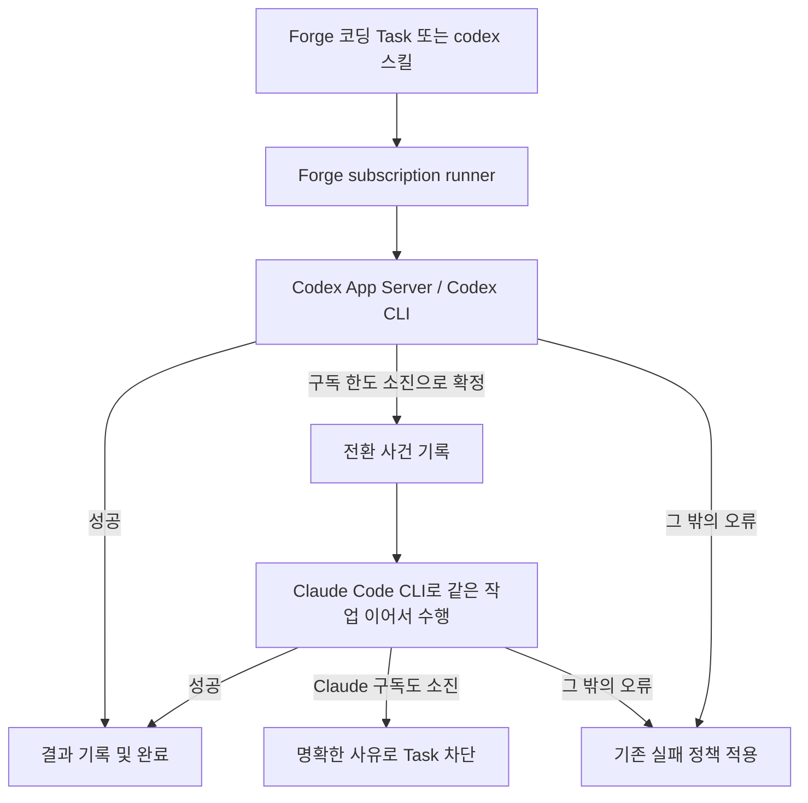

# 구독 기반 Codex 우선·Claude 전환 실행 설계

- 상태: 사용자 설계 검토 대기
- 작성일: 2026-07-17
- 적용 대상: Windows 로컬, VPS, EC2
- 결제 원칙: ChatGPT/Codex 구독 및 Claude Max 구독만 사용

## 1. 결정 요약

Forge의 코딩 실행 계층은 Codex를 기본으로 사용한다. Codex 구독 한도 소진이 **확실하게 판별된 경우에만** 같은 작업을 Claude Code CLI로 이어서 수행한다.

전환 범위는 다음 두 곳으로 제한한다.

1. Forge가 관리하는 코딩 Task/worker
2. Hermes에서 호출하는 `codex` 및 `claude-code` 스킬

일반 Hermes 대화에는 자동 전환을 적용하지 않는다. OpenAI API 키와 Anthropic API 키를 실행 자격 증명으로 사용하지 않으며, 어떤 실패도 종량제 API로 우회하지 않는다.

## 2. 현재 상태와 목표 상태

### 현재 확인된 상태

| 환경 | Hermes | Codex CLI | Claude Code CLI | 구독 로그인 | Codex App Server |
|---|---|---|---|---|---|
| Windows | 설치됨 | 설치됨 | 설치됨 | Codex·Claude 정상 | 미활성 |
| EC2 | 설치됨 | 설치됨 | 설치됨 | Codex·Claude 정상 | 미활성 |
| VPS | 설치됨 | 설치됨 | 미설치 | Codex만 정상 | 미활성 |

Hermes의 `openai-codex` 인증은 사용할 수 있지만, `anthropic` provider를 Claude Max 구독으로 직접 대체할 수는 없다. Claude Max는 Claude Code CLI 로그인 경로로 사용해야 한다.

### 목표 상태

| 실행 종류 | 기본 실행 | 허용된 전환 | 금지 사항 |
|---|---|---|---|
| Forge 코딩 Task | Codex App Server | Codex 구독 한도 소진 시 Claude Code CLI | 일반 오류 전환, API 전환 |
| Hermes `codex` 스킬 | Codex CLI | Codex 구독 한도 소진 시 Claude Code CLI | 무한 재시도, API 전환 |
| Hermes `claude-code` 스킬 | Claude Code CLI | 없음 | Codex로 역전환, API 전환 |
| 일반 Hermes 대화 | 기존 Hermes 기본 모델 | 없음 | 자동 Claude 전환 |

## 3. 검토한 접근과 선택

### 접근 1: Forge 실행 래퍼에서 전환 — 선택

Forge가 관리하는 하나의 실행 래퍼가 Codex 시도와 Claude 시도를 순서대로 소유한다. Task dispatcher에는 래퍼 하나만 보이므로 두 CLI 사이를 전환해도 Task의 활성 run은 하나로 유지한다.

- 장점: 전환 범위가 Forge Task와 스킬로 명확히 제한된다.
- 장점: 일반 Hermes 대화에 영향을 주지 않는다.
- 장점: Hermes upstream 수정 없이 배포할 가능성이 가장 높다.
- 단점: dispatcher가 자식 Hermes 프로세스 종료 전에 run을 종결하는지 구현 시 검증해야 한다.

### 접근 2: Hermes dispatcher 자체 수정

Hermes의 Kanban dispatcher에 provider 전환 로직을 직접 넣는다.

- 장점: Task 상태와 프로세스 수명을 가장 직접적으로 제어할 수 있다.
- 단점: Hermes 업데이트마다 로컬 패치를 재적용해야 한다.
- 단점: 일반 Hermes 동작과 Forge 전용 정책의 경계가 흐려진다.

접근 1의 run 생명주기 검증이 실패할 때만 제한적으로 사용한다.

### 접근 3: 실패한 Task를 새 Claude Task로 복제

Codex Task 실패 후 동일 내용을 Claude용 새 카드로 생성한다.

- 장점: 두 실행을 완전히 분리할 수 있다.
- 단점: Task와 완료 run이 중복되어 현재 Forge 검증 규칙과 충돌한다.
- 단점: 부분 변경, 브랜치, 리뷰 이력을 합치는 비용이 크다.

선택하지 않는다.

## 4. 실행 구조

### 4.1 공통 subscription runner

Windows와 Linux에서 같은 정책을 쓰는 Forge 소유 실행기를 둔다. 운영체제별 시작 스크립트는 얇게 유지하고, 판별·상태 기록·전환 결정은 하나의 공통 모듈에서 수행한다.

실행기는 다음 입력을 받는다.

- 실행 종류: `task`, `codex-skill`, `claude-skill`
- 작업 지시문과 작업 디렉터리
- Task인 경우 카드 ID, run ID, workspace, branch
- 기본 runtime과 허용된 fallback runtime
- 실행별 제한 시간과 출력 경로

실행기는 다음 불변 조건을 지킨다.

- 한 run에서 Codex 시도는 최대 1회, Claude 전환은 최대 1회다.
- Claude에서 다시 Codex로 돌아가지 않는다.
- 일반 Hermes 대화는 이 실행기를 통과하지 않는다.
- API 키가 자식 프로세스에 전달되지 않는다.
- 알 수 없는 오류는 구독 한도 소진으로 추정하지 않는다.

### 4.2 Forge Task의 단일 run 유지

dispatcher가 시작하는 최상위 프로세스를 subscription runner로 둔다. runner가 살아 있는 동안 Codex 자식과 필요한 경우 Claude 자식을 순서대로 실행한다. dispatcher 관점에서는 하나의 claimed run만 존재한다.

구현 전 반드시 다음을 통합 테스트로 증명한다.

1. Codex 자식이 오류로 종료되어도 runner가 살아 있으면 Task가 조기 실패 처리되지 않는다.
2. 같은 `HERMES_KANBAN_RUN_ID`로 Claude가 `kanban_complete`를 호출할 수 있다.
3. 최종적으로 완료된 run이 정확히 하나만 남는다.

이 세 조건 중 하나라도 충족되지 않으면, Hermes 전체를 포크하지 않고 dispatcher의 worker spawn 경계만 최소 패치한다. 패치는 Forge에서 관리하고 Hermes 버전별 호환 테스트를 둔다.

### 4.3 Codex App Server

세 환경 모두 Hermes 설정의 실제 runtime을 `codex_app_server`로 활성화한다. 단순 compaction 설정만으로 활성화되었다고 판단하지 않는다.

활성화 결과는 다음과 같다.

- Codex의 터미널·파일·패치 도구가 주 실행 도구가 된다.
- Hermes 웹·브라우저·비전·이미지·스킬·Kanban 도구는 `hermes-tools` MCP로 연결한다.
- 기존 Hermes MCP 서버는 Codex MCP 설정으로 멱등 마이그레이션한다.
- 설정 파일 값, App Server 프로세스 시작, MCP 도구 호출을 각각 검증한다.

### 4.4 Claude Code CLI 실행

Claude 전환 시 새 Task를 만들지 않고 같은 workspace와 branch에서 이어서 실행한다. Codex가 남긴 부분 변경이 있을 수 있으므로 Claude 프롬프트에는 다음 정보를 포함한다.

- 원래 작업 지시문
- Codex가 구독 한도로 중단되었다는 사실
- 현재 Git 상태와 변경 요약
- 이미 수행된 작업을 덮어쓰지 말고 이어서 검증하라는 지시
- Task ID와 동일한 완료·차단 규칙

Claude Code에는 CLI 기본 도구와 허용된 MCP 도구를 제공한다. Task 실행에서는 `hermes-tools`의 Kanban 도구도 사용할 수 있어야 한다. 프로필별 격리 HOME을 사용하는 Linux 배포에는 구독 로그인 자격 증명을 복사하지 않고, 실제 사용자 Claude 설정 디렉터리를 안전하게 참조하도록 연결한다.

## 5. 전환 판별 규칙

### 5.1 전환 가능한 유일한 사유

Codex adapter가 수집한 구조화 오류를 정규화했을 때 `subscription_quota_exhausted`인 경우만 Claude로 전환한다.

adapter의 허용 목록에는 다음 출처만 들어간다.

- Codex App Server의 구조화된 오류 code/type
- Codex CLI의 구조화 출력에 포함된 오류 code/type
- 실제 구독 한도 오류에서 수집해 비밀정보를 제거한 회귀 테스트 fixture

사람이 읽는 메시지의 일부 문자열만 보고 전환하지 않는다. Codex 버전에서 새 오류 형식이 나타나면 기본값은 `unknown`이며 전환하지 않는다.

### 5.2 전환하지 않는 오류

다음은 Codex 실패로 처리하며 Claude를 자동 호출하지 않는다.

- 로그인 만료, 인증 실패
- 네트워크·DNS·프록시 오류
- 모델명 또는 설정 오류
- MCP/도구 호출 오류
- 사용자 취소와 시간 초과
- 프로세스 crash 또는 알 수 없는 종료 code
- 정책 거부, 입력 오류, 컨텍스트 오류

### 5.3 Claude도 한도 소진인 경우

Claude adapter가 구독 한도 소진을 확정하면 Task를 `blocked`로 전환하고 다음 정보를 남긴다.

- Codex와 Claude 양쪽 구독 한도 소진
- 각 시도 시각과 runtime
- 재개에 필요한 조치: 구독 한도 갱신 후 Task 재개

종량제 API, 다른 provider, 무한 재시도는 사용하지 않는다.

Claude의 다른 오류는 기존 Task 실패·재시도 정책을 따른다. 단, 같은 run 안에서 runtime 전환은 다시 일어나지 않는다.

## 6. 스킬 실행 정책

### `codex` 스킬

기존 Codex CLI 직접 실행을 공통 subscription runner 호출로 바꾼다. Codex 성공 시 종료하고, 확정된 구독 한도 소진만 Claude Code CLI로 같은 작업 디렉터리에서 이어서 실행한다.

사용자에게는 다음 전환을 숨기지 않는다.

- `Codex 구독 한도 소진 확인`
- `Claude Code CLI로 1회 전환`
- 최종 실행 runtime

### `claude-code` 스킬

Claude Code CLI를 직접 사용한다. 이 스킬은 사용자가 Claude를 명시 선택한 것이므로 Codex를 선행 호출하지 않고 Codex로 역전환하지 않는다.

### 일반 Hermes 대화

기존 provider/runtime 정책을 그대로 사용한다. 대화 오류나 한도 소진이 발생해도 이 설계의 fallback을 호출하지 않는다.

## 7. 구독 인증과 비용 안전장치

각 머신에서 CLI 자체 로그인 상태를 확인한다.

- Codex: ChatGPT 구독 로그인
- Claude Code: Claude Max 로그인

subscription runner는 자식 Codex·Claude 프로세스 환경에서 다음 API 자격 증명을 제거한다.

- `OPENAI_API_KEY`
- `ANTHROPIC_API_KEY`
- adapter가 지원하는 기타 종량제 provider API 키

사용자 시스템의 원본 환경 변수나 secret 파일은 수정·삭제하지 않는다. 자식 프로세스에 전달되는 환경만 정리한다. 로그인 상태 검사에서 구독 경로를 확인하지 못하면 실행을 중단하고 재로그인을 요구한다.

인증 파일을 저장소, 배포 번들, 로그에 복사하지 않는다. Windows·EC2는 기존 로그인을 검증하고, VPS는 Claude Code 설치 후 사용자가 공식 로그인 흐름을 한 번 완료해야 한다.

## 8. 배포 설계

### 공통

- runner와 adapter를 Forge 배포 산출물에 포함한다.
- 설정은 관리 블록으로 생성하고 재실행해도 중복되지 않게 한다.
- 기존 사용자 설정은 관리 블록 밖에서 보존한다.
- 배포 전 백업과 배포 후 smoke test를 수행한다.

### Windows

- 기존 Codex·Claude 구독 로그인 확인
- Hermes의 Codex App Server runtime 활성화
- Forge worker와 두 스킬을 subscription runner에 연결
- Windows 경로·인자 quoting·Unicode workspace 통합 테스트

### EC2

- 기존 Codex·Claude 구독 로그인 확인
- profile HOME에서 `.codex`와 `.claude` 구독 설정을 안전하게 참조
- systemd gateway/worker 환경에 runner와 App Server 설정 반영
- daemon reload 및 서비스 재시작 후 smoke test

### VPS

- Claude Code CLI 설치
- 사용자에게 Claude Max 로그인 1회 요청
- EC2와 같은 profile·systemd 설정 적용
- 로그인 전에는 Claude fallback readiness를 실패로 표시하고 Codex 기본 실행은 유지

VPS 로그인이 완료되지 않은 상태를 전체 배포 성공으로 보고하지 않는다.

## 9. 관측성과 상태 기록

각 실행은 비밀정보를 제외한 구조화 event를 남긴다.

| 필드 | 의미 |
|---|---|
| `task_id` / `run_id` | Task 실행 식별자 |
| `attempt` | 1=Codex, 2=Claude |
| `primary_runtime` | 항상 Codex인 자동 경로의 기본 runtime |
| `final_runtime` | 실제 결과를 낸 runtime |
| `fallback_reason` | `subscription_quota_exhausted` 또는 없음 |
| `started_at` / `ended_at` | 시도 시각 |
| `exit_class` | success, quota, auth, network, tool, unknown 등 |

토큰, OAuth 자격 증명, 전체 프롬프트와 민감한 도구 출력은 event에 기록하지 않는다. Task 결과에는 runtime 전환 사실과 최종 runtime을 사람이 읽을 수 있게 남긴다.

## 10. 검증 기준

### 단위 테스트

- 구조화된 Codex quota fixture만 fallback 대상으로 분류
- auth/network/tool/unknown fixture는 fallback 금지
- API 키가 자식 환경에서 제거됨
- 한 run당 Codex 1회·Claude 1회 제한
- Claude 스킬은 Codex를 호출하지 않음

### 통합 테스트

- Codex 성공: Claude 미호출, Task 정상 완료
- Codex quota: Claude 1회 호출, 같은 workspace/run에서 정상 완료
- Codex 일반 오류: Claude 미호출, 기존 실패 처리
- Codex quota + Claude quota: Task blocked, API 미호출
- Codex 부분 변경 후 fallback: Claude가 변경을 보존하고 검증해 완료
- 일반 Hermes 대화 실패: fallback runner 미호출
- App Server에서 Codex 기본 도구와 `hermes-tools` MCP 각각 호출 성공
- 같은 Task에 완료 run이 정확히 1개

### 환경별 승인 조건

| 조건 | Windows | EC2 | VPS |
|---|---:|---:|---:|
| Codex 구독 로그인 | 필수 | 필수 | 필수 |
| Claude Max 로그인 | 필수 | 필수 | 필수 |
| App Server 실제 활성화 | 필수 | 필수 | 필수 |
| 두 스킬 CLI 경로 검증 | 필수 | 필수 | 필수 |
| quota 모의 전환 smoke test | 필수 | 필수 | 필수 |
| API 자격 증명 비전달 검증 | 필수 | 필수 | 필수 |
| 배포 재실행 멱등성 | 필수 | 필수 | 필수 |

## 11. 롤백

롤백은 사용자 로그인과 CLI 설치를 삭제하지 않는다.

1. Forge worker와 스킬을 기존 실행 경로로 되돌린다.
2. Hermes runtime을 기존 `auto` 또는 배포 전 값으로 복원한다.
3. 관리형 MCP·service 설정 블록만 제거하고 사용자 설정은 보존한다.
4. 서비스를 재시작하고 Codex 기본 Task와 일반 Hermes 대화를 smoke test한다.

Task 이력과 전환 event는 감사 기록으로 보존한다.

## 12. 3~5수 앞의 영향

### 1수: 세 환경 일관성

공통 runner로 판별 정책을 한 곳에 모아 Windows와 Linux의 동작 차이를 줄인다. VPS 로그인만 사용자 상호작용이 필요한 별도 gate다.

### 2수: Codex 오류 형식 변경

허용 목록 기반 adapter라서 새 형식을 quota로 오판하지 않는다. 자동 전환은 일시 중단될 수 있지만 잘못된 Claude 호출보다 안전하며 fixture 추가로 복구할 수 있다.

### 3수: 부분 작업과 재시도

같은 workspace/run을 유지해 변경 병합 비용을 피한다. 대신 Claude가 현재 diff를 먼저 읽고 이어서 작업하도록 강제하고, runtime 전환 횟수를 제한한다.

### 4수: 구독 동시 사용 증가

세 머신에 기능이 있어도 같은 Task를 여러 머신에서 중복 실행하지 않는다. 기존 Task claim이 단일 소유권을 유지하며, provider별 로컬 동시 실행 제한을 둬 전환 폭주를 막는다. 교차 호스트 전역 quota 예측은 신뢰할 수 없으므로 실제 구조화 오류를 최종 근거로 사용한다.

### 5수: Hermes·CLI 업그레이드

upstream 전체 포크를 피하고 spawn 경계와 adapter만 관리한다. 배포 전 호환성 test가 실패하면 서비스 변경 전에 중단되므로 세 환경을 동시에 망가뜨리지 않는다.

## 13. 실패 시나리오와 회복 비용

| 실패 시나리오 | 기본 대응 | 회복 비용 |
|---|---|---|
| quota 오판 | 허용 목록 외 오류는 전환 금지 | fixture와 adapter 수정 후 재배포 |
| Claude 로그인 만료 | Task 실패/차단 및 재로그인 안내 | 해당 머신 1회 로그인 |
| runner가 단일 run을 유지하지 못함 | 배포 gate 실패, spawn 경계 최소 패치 | Hermes 버전별 작은 호환 패치 유지 |
| App Server MCP 마이그레이션 실패 | 백업 복원, runtime 원복 | 설정 복원 및 재시작 |
| 두 구독 모두 소진 | Task blocked | 한도 갱신 후 수동 재개 |
| 한 머신 배포 실패 | 해당 머신만 원복, 나머지 결과 보존 | 머신별 재배포 |

## 14. 구현 경계

이번 설계 승인 후 별도 구현 계획에서 파일 단위 작업과 검증 순서를 확정한다. 구현은 다음 경계를 넘지 않는다.

- Hermes 일반 대화 provider의 자동 전환을 추가하지 않는다.
- API 종량제 fallback을 추가하지 않는다.
- 인증 secret을 복사하거나 저장소에 넣지 않는다.
- Task를 복제해 이중 완료 상태를 만들지 않는다.
- 검증되지 않은 오류 메시지 문자열을 quota 판별 근거로 사용하지 않는다.

## 참고 자료

- [Hermes provider 설정](https://github.com/NousResearch/hermes-agent/blob/main/website/docs/integrations/providers.md)
- [Hermes slash commands](https://github.com/NousResearch/hermes-agent/blob/main/website/docs/reference/slash-commands.md)
- [Hermes 기본 스킬 목록](https://github.com/nousresearch/hermes-agent/blob/main/website/docs/reference/skills-catalog.md)
- [OpenAI Codex App Server](https://learn.chatgpt.com/docs/app-server)
- [Anthropic Claude Code 시작하기](https://docs.anthropic.com/en/docs/claude-code/getting-started)
