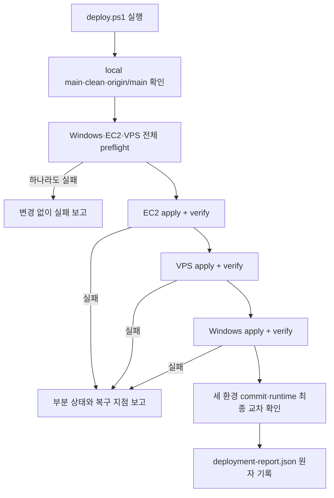

# Windows·EC2·VPS 단일 명령 배포 설계

- 상태: 구현 완료, production 재검증 대기
- 작성일: 2026-07-17
- 적용 대상: Windows 로컬 Hermes, EC2, OVH VPS
- 배포 기준: 검사를 통과해 `origin/main`에 병합된 커밋
- 사용자 결정: main 병합 후 PowerShell 명령 1회 방식

## 1. 결정 요약

`forge/scripts/deploy.ps1`을 세 환경의 유일한 배포 진입점으로 유지한다. 운영자는 검증된 main에서 다음 명령을 한 번 실행한다.

```powershell
pwsh -NoProfile -File forge/scripts/deploy.ps1
```

스크립트는 모든 대상의 사전 조건을 먼저 확인한 뒤 EC2, VPS, Windows 순서로 같은 Git commit을 반영하고 각 환경을 즉시 검증한다. feature branch, dirty worktree, main과 다른 commit, 검사되지 않은 로컬 파일은 배포하지 않는다.

Windows에는 현재 빠져 있는 Infinity Forge Task 플러그인, Hermes `pre_user_turn` 변경, Task 설정 DB, 역할별 스킬과 Task 프롬프트 런타임까지 설치한다. EC2와 VPS는 기존 `deploy-vps.sh` 경로를 재사용한다.

## 2. 현재 확인된 상태

| 항목 | 현재 상태 | 설계에 미치는 영향 |
|---|---|---|
| 로컬 Forge branch | `codex/stage-orchestrator@edcdc90` | production 배포 불가 |
| `origin/main` | `a3965c3` | 새 Task 양식 없음 |
| PR #16 | open, main과 conflict, 검사 결과 없음 | 충돌 해결·검사·병합이 선행돼야 함 |
| EC2 | clean `main@a3965c3`, Gateway·세 타이머 active | 기존 서버 adapter 사용 가능 |
| VPS | clean `main@a3965c3`, Gateway·세 타이머 active | 기존 서버 adapter 사용 가능 |
| Windows Hermes | Desktop build `sourceMode=false`; `.git@540f901`과 live source 6개가 불일치, Infinity Forge plugin 없음 | stale Git archive가 아니라 중지된 live runtime snapshot을 사용해야 함 |
| Windows Gateway | 로그인 시작 항목은 설치됐지만 현재 process는 stopped | 배포 전 실행 상태를 보존해야 함 |
| 기존 `deploy.ps1` | EC2·VPS 배포/검증, Windows는 스킬 복사만 수행 | Windows adapter와 전체 preflight를 보강해야 함 |

## 3. 검토한 접근

### 접근 1: main에서 PowerShell 명령 1회 — 선택

기존 `deploy.ps1`이 세 환경의 preflight, apply, verify를 순차 실행한다.

- 장점: 현재 배포 코드와 운영 규칙을 가장 많이 재사용한다.
- 장점: 배포 시점이 사람에게 보이고 실패한 환경을 즉시 확인할 수 있다.
- 장점: GitHub Actions용 서버 SSH key와 상시 Windows runner가 필요 없다.
- 단점: main 병합 뒤 사람이 명령을 한 번 실행해야 한다.

### 접근 2: main push 뒤 GitHub Actions 자동 배포

GitHub Actions가 Windows self-hosted runner와 SSH를 통해 세 환경을 자동 배포한다.

- 장점: 사람의 실행 단계를 없앨 수 있다.
- 단점: 잘못된 main 병합이 즉시 세 환경으로 확산된다.
- 단점: Windows runner 상시 운영과 서버 배포 secret 관리가 추가된다.
- 단점: 장애 시 GitHub, runner, SSH 중 어느 계층이 원인인지 조사 범위가 넓어진다.

### 접근 3: release tag 기반 배포

사람이 release tag를 만들 때만 세 환경에 반영한다.

- 장점: 배포 승인 경계와 이력을 명확히 분리한다.
- 단점: 작은 변경마다 tag 관리가 필요하고 사용자가 원하는 즉시 반영 흐름보다 느리다.

현재 규모에서는 접근 1이 실패 반경과 운영 비용의 균형이 가장 좋다. GitHub Actions 전환은 배포 빈도와 담당자가 늘어 수동 명령이 병목이 될 때 다시 검토한다.

## 4. 배포 불변 조건

모든 배포는 다음 조건을 동시에 만족해야 한다.

1. 로컬 실행 저장소가 `main`이다.
2. 로컬 tracked·untracked 상태가 모두 clean이다.
3. 로컬 `HEAD`, `origin/main`, 배포 요청 commit이 정확히 같다.
4. EC2와 VPS 저장소가 `main`이며 clean이다.
5. 두 서버의 현재 commit이 요청 commit의 ancestor라서 fast-forward가 가능하다.
6. Windows Hermes root, Python, GitHub CLI, plugin·data 경로가 기대한 사용자 영역 안에 있다.
7. 선택된 모든 대상의 preflight가 성공하기 전에는 어느 대상도 변경하지 않는다.
8. 세 환경의 최종 Forge commit은 하나의 40자리 SHA로 같아야 한다.
9. 자동 병합 안전 스위치는 배포가 성공해도 `false`를 유지한다.
10. secret 원문은 명령 출력, 배포 보고서, Git 저장소에 기록하지 않는다.

## 5. 구성 요소

### 5.1 `forge/scripts/deploy.ps1`

전체 흐름만 소유하는 orchestrator다.

- main·clean·origin commit 확인
- Windows·EC2·VPS 전체 preflight
- 대상별 adapter 순차 호출
- 대상별 검증 결과 수집
- 최종 commit 일치 확인
- 로컬 배포 보고서 기록

`-SkipEC2`, `-SkipVPS`, `-SkipLocal`은 긴급 점검과 재실행을 위해 유지한다. 기본 실행은 세 환경 전체다. skip을 사용한 실행은 "모든 대상 완료"로 표시하지 않고 어떤 대상이 생략됐는지 보고한다.

### 5.2 `forge/scripts/deploy-windows.ps1`

Windows 한 환경만 담당하는 새 adapter다.

- 정확한 Forge commit의 release snapshot 생성
- Hermes `pre_user_turn` 변경 package build/install
- Infinity Forge plugin과 release pointer 설치
- Hermes `.env`의 Forge 비밀이 아닌 경로 설정 갱신
- Task DB와 역할별 profile·skill 준비
- 기존 Windows Gateway 실행 상태 보존
- 설치 뒤 Windows 검증

PowerShell orchestrator 안에 Windows 세부 로직을 계속 늘리지 않고 별도 adapter로 분리해 서버 adapter인 `deploy-vps.sh`와 책임을 맞춘다.

### 5.3 `forge/scripts/deploy-vps.sh`

EC2와 VPS가 공유하는 기존 Linux adapter를 유지한다. exact main commit fast-forward, Hermes 변경 설치, plugin/profile/skill 반영, systemd timer와 Gateway 재시작을 계속 담당한다.

### 5.4 Windows immutable release

Windows plugin이 사용자의 현재 Git checkout을 직접 import하면 branch 전환이나 미커밋 수정이 즉시 운영 동작을 바꾼다. 이를 금지하기 위해 다음 구조를 사용한다.

```text
%LOCALAPPDATA%\InfinityForge\
  releases\<40자리 Forge SHA>\
    forge\
    deployment-source.json
  state\
    deployment-report.json

%LOCALAPPDATA%\hermes\plugins\infinity-forge\
  plugin.yaml
  __init__.py
  release-path.txt
```

release는 `git archive`로 요청 commit의 tracked 파일만 새 임시 디렉터리에 풀고, 검증 후 `<SHA>` 디렉터리로 원자 승격한다. `release-path.txt`에는 해당 release의 절대 경로 한 줄만 기록한다.

plugin은 Forge 모듈 import 전에 pointer를 읽는다. pointer가 존재하면 다음을 모두 확인한 뒤 release 경로를 `sys.path` 앞에 추가한다.

- 절대 경로다.
- `%LOCALAPPDATA%\InfinityForge\releases` 아래다.
- 경로 이름이 40자리 소문자 Git SHA다.
- `forge/__init__.py`와 `forge/ops/task_setup.py`가 존재한다.

pointer가 없는 EC2·VPS에서는 현재처럼 service의 `PYTHONPATH`를 사용한다. pointer가 있는데 검증에 실패하면 다른 경로로 조용히 fallback하지 않고 plugin load를 실패시킨다.

## 6. Windows 설정과 설치 순서

### 6.1 경로와 환경 설정

Windows Hermes의 기존 `.env`는 secret을 포함하므로 전체 파일을 덮어쓰지 않는다. Hermes venv의 `hermes_cli.config.save_env_value`를 호출해 다음 세 값만 원자 갱신한다.

- `INFINITY_FORGE_REPOSITORY=immortal0900/INFINITY_FORGE`
- `INFINITY_FORGE_TASK_SETTINGS_DB=${LOCALAPPDATA}\hermes\infinity-forge\task-settings.db`
- `INFINITY_FORGE_GH_PATH=<검증된 gh.exe 절대 경로>`

값 자체는 secret이 아니지만 `.env` 내용은 출력하지 않는다. Task DB 경로는 Hermes의 환경값 저장 helper가 한글 사용자 경로를 손상시키지 않도록 ASCII 표기만 저장하고, `python-dotenv`가 실행 시 `${LOCALAPPDATA}`를 실제 경로로 확장한다. 검증 단계에서 확장된 값이 배포 대상 DB 절대경로와 같은지 확인한다. Task outbox DB는 Task settings DB의 표준 파생 경로를 사용한다.

### 6.2 Hermes user-turn 변경

서버와 같은 `install-hermes-change.py`를 사용한다. Windows package version은 Forge commit과 Hermes live runtime fingerprint에 고정한다.

```text
<Forge commit>-<Hermes runtime fingerprint 40자리>
```

Windows Desktop 설치는 source checkout의 Git HEAD와 실제 실행 파일이 다를 수 있다. Gateway를 중지한 뒤 installer가 변경하는 여섯 live source의 경로와 bytes로 SHA-256을 계산하고 앞 40자리를 runtime fingerprint로 사용한다. 이전 성공 배포 state가 있으면 그 package로 먼저 원본을 restore한 뒤, 여섯 파일만 짧은 sibling temporary directory에 복사해 새 package를 build한다. install은 기존 installer의 파일 hash, backup, atomic replace, 부분 실패 restore 규칙을 그대로 사용한다.

### 6.3 plugin·profile·skill

plugin 디렉터리는 sibling temporary directory에서 완성하고 기존 디렉터리와 교체한다. 이어서 `hermes plugins enable infinity-forge`를 실행한다. enabled 상태는 표시용 CLI 행 형식이 아니라 `hermes_cli.config.load_config()`의 `plugins.enabled` 목록에서 정확히 확인한다.

기존 profile은 과거 Task나 사용자 설정이 참조할 수 있으므로 배포 중 이름을 변경하거나 삭제하지 않는다. `builder`, `deep_checker`, `fix`가 없을 때만 표준 profile을 복제해 추가한다.

공용·역할별 skill은 현재 Linux 배치와 같은 mapping을 사용한다.

| 대상 | 추가 skill |
|---|---|
| 기본 Gateway | forge-ops, memex, code-design-principles, forge-labels, easy-answer, code-problem-doc |
| builder | build-task |
| reviewer | review-task, code-problem-doc |
| deep_checker | deep-check |
| fix | fix-task |

### 6.4 Gateway 상태 보존

배포 직전에 Windows Gateway process 상태를 기록한다.

- 실행 중이었다면 설치·검증을 위해 중지한 뒤 성공 시 다시 시작한다.
- 중지 상태였다면 설치 후에도 자동 시작하지 않는다.
- 실패 시 가능한 범위에서 이전 plugin, pointer, Hermes patch와 Gateway 상태를 복원한다.

로그인 시작 항목의 등록 여부는 변경하지 않는다.

## 7. 전체 실행 흐름



EC2를 먼저 두는 것은 기존 orchestrator 순서를 유지하고 VPS 변경 전에 첫 Linux 환경에서 설치·검증 오류를 잡기 위해서다. EC2를 공식 staging으로 간주하지는 않는다. 세 환경은 최종적으로 모두 같은 production commit을 사용한다.

## 8. 검증 기준

### 공통

- 대상 release SHA가 요청한 `origin/main` SHA와 같다.
- repository와 runtime 경로에 예상 밖 수정이 없다.
- Task content prompt에 `[SPEC-NNN]`, `[AC-01]`, `## 확정된 제약`이 표시된다.
- Task settings/outbox/Kanban DB의 `PRAGMA quick_check` 결과가 `ok`다.
- plugin이 enabled 상태이며 user-turn hook marker 여섯 개가 존재한다.
- 검증 과정은 GitHub issue나 Kanban card를 만들지 않는다.

### EC2·VPS

- `hermes-gateway`가 active다.
- `forge-stage`, `forge-mirror`, `forge-merge` timer가 active다.
- worker import check와 dry-run이 성공한다.
- 자동 병합 환경값은 `AUTO_MERGE_ENABLED=false`다.

### Windows

- plugin의 `release-path.txt`가 배포 SHA release를 가리킨다.
- release에서 import한 `TASK_CONTENT_TEMPLATE`가 새 표준 양식과 일치한다.
- Hermes 설정의 `plugins.enabled` 목록에 `infinity-forge`가 정확히 존재한다.
- `.env`에서 확장한 Task settings DB 경로가 실제 검증 대상 절대경로와 같다.
- Hermes patch 대상 여섯 파일의 설치 hash가 package manifest와 일치한다.
- 배포 전 Gateway가 running이었다면 배포 후 process가 감지되고, stopped였다면 stopped 상태가 유지된다.

## 9. 실패 처리와 재실행

전체 preflight는 쓰기 전에 끝낸다. apply 시작 뒤에는 각 환경을 적용 직후 검증하고 다음 환경으로 넘어간다.

나중 환경이 실패했다고 앞선 서버를 자동 rollback하지 않는다. DB와 Task 상태가 있는 환경에서 코드만 과거로 돌리면 더 큰 불일치를 만들 수 있기 때문이다. 대신 다음을 수행한다.

1. 어느 환경이 `not-started`, `verified`, `failed`인지 명확히 기록한다.
2. 실패한 명령의 종료 code와 비밀이 제거된 요약을 남긴다.
3. 성공한 환경의 commit을 다시 읽어 보고한다.
4. 원인을 고친 뒤 같은 SHA로 명령을 재실행한다.

Windows 내부에서 pointer·plugin·Hermes patch 교체가 완료되기 전에 실패하면 그 Windows transaction만 이전 상태로 복원한다. 같은 SHA 재실행은 release와 package를 hash 검증한 뒤 안전하게 재사용해야 한다.

어떤 실패도 "일부 성공"을 전체 성공으로 표시하지 않는다.

## 10. 배포 보고서

다음 위치에 secret 없는 JSON 보고서를 원자 기록한다.

```text
%LOCALAPPDATA%\InfinityForge\state\deployment-report.json
```

필수 필드는 다음과 같다.

- format version
- 요청 Forge SHA
- 시작·종료 UTC 시각
- 실행한 local user
- 각 대상의 preflight/apply/verify 상태
- 각 대상에서 확인한 Forge SHA
- Gateway·timer 검증 결과
- 생략한 대상
- 실패 단계와 비밀이 제거된 오류 요약

보고서는 운영 확인용이며 인증정보와 `.env` 값, command 전체 환경은 저장하지 않는다.

## 11. 장기 동작과 회복 비용

### 다음 배포

같은 명령은 새 main SHA release를 만들고 세 환경을 같은 commit으로 수렴시킨다. 이미 정확한 SHA인 대상도 검증은 다시 수행한다.

### 사용자가 branch를 바꾸거나 파일을 수정할 때

Windows runtime은 immutable release를 사용하므로 운영 Task 동작은 바뀌지 않는다. 다음 배포도 clean main에서만 실행된다.

### Hermes가 업데이트될 때

서버는 Hermes source SHA가, Windows는 live runtime fingerprint가 달라져 새 patch package가 만들어진다. Windows의 이전 성공 package를 먼저 restore하므로 이미 설치한 Forge patch를 새 source로 오인하지 않는다. 기존 package의 hash와 live runtime이 맞지 않으면 build/install을 진행하지 않고 명시적으로 실패한다.

### 6개월 뒤 release 누적

초기 구현에서는 자동 삭제를 넣지 않는다. 배포 성공과 복구 경로가 충분히 실증된 뒤 별도 보존 정책을 정한다. 자동 정리 실수로 마지막 known-good release를 잃는 비용이 초기 디스크 사용량보다 크기 때문이다.

### 부분 배포 실패

이미 검증된 환경은 유지하고 실패 대상만 고쳐 같은 SHA로 재실행한다. 상태형 DB를 포함한 전 환경 자동 rollback은 이 설계 범위에서 제외한다.

## 12. 최초 적용 순서

1. PR #16과 최신 main의 conflict를 해결한다.
2. 전체 관련 테스트와 GitHub `eval`을 통과시킨다.
3. bypass 없이 PR을 main에 병합한다.
4. clean main에서 `deploy.ps1` 전체 preflight를 실행한다.
5. EC2 → VPS → Windows 순서로 적용·검증한다.
6. 세 환경의 SHA와 Task 프롬프트를 교차 확인한다.
7. 작은 `Build + Review + Deep Check + Manual` Task를 별도 운영 시험으로 실행한다.

이번 Task 양식 변경만 feature branch에서 직접 복사하는 임시 배포는 하지 않는다.

## 13. 테스트 전략

### 결정론 테스트

- PowerShell parser가 두 배포 script를 성공적으로 parse한다.
- Windows preflight가 잘못된 branch, dirty tree, 다른 origin SHA, 누락된 Hermes/gh를 거부한다.
- 세 대상 중 하나의 preflight 실패 시 apply 호출이 0회다.
- 대상 실행 순서가 EC2 → VPS → Windows다.
- skip 대상은 보고서에 `skipped`로 기록된다.
- Windows release는 요청 SHA의 tracked 파일만 포함한다.
- 잘못된 release pointer는 plugin import를 실패시킨다.
- `.env` 갱신은 기존 secret line을 보존한다.
- Windows Gateway의 running/stopped 상태가 배포 뒤 보존된다.
- 같은 SHA 재실행 결과가 동일하다.

### 통합 테스트

- 임시 Hermes checkout에서 Windows patch package build/install/restore를 검증한다.
- 임시 Hermes home에서 plugin enable과 Task prompt import를 검증한다.
- SSH command adapter는 fake executable을 사용해 preflight/apply/verify 순서와 실패 전파를 검증한다.
- 실제 production 적용 전 `-SkipVPS -SkipLocal` 같은 제한 실행을 사용하는 대신 별도 test fixture에서 실행 경로를 증명한다. production skip 실행은 전체 성공 증거로 사용하지 않는다.

### production 검증

- 세 환경의 exact SHA, plugin, hook, DB, Gateway/timer를 다시 읽는다.
- Task prompt의 표준 양식 marker를 직접 확인한다.
- 최종 운영 시험 Task는 GitHub issue, PR, Build·Review·Deep Check 결과가 같은 commit에 묶였는지 확인한다.

## 14. 범위 제외

- feature branch push 즉시 자동 배포
- GitHub Actions와 Windows self-hosted runner 구축
- 서버 DB schema 자동 rollback
- 세 환경의 Hermes 자체 버전 자동 upgrade
- 자동 병합 안전 스위치 활성화
- 배포 성공 전 오래된 Windows release 자동 삭제
- SSH host, 사용자, repository를 임의 설정으로 일반화

## 15. 완료 조건

1. clean `origin/main` commit 하나를 명령 1회로 세 환경에 배포할 수 있다.
2. 모든 대상 preflight가 끝나기 전에 어느 환경도 변경되지 않는다.
3. Windows에 Infinity Forge plugin, hook, immutable release, Task DB와 표준 Task prompt가 설치된다.
4. EC2와 VPS는 기존 Linux adapter로 같은 commit을 사용한다.
5. 세 환경 모두 배포 SHA와 runtime 검증을 통과해야 전체 성공으로 끝난다.
6. 실패하면 대상·단계·부분 완료 상태가 명확히 남는다.
7. 같은 SHA 재실행이 안전하다.
8. 기존 secret과 사용자의 무관한 작업 파일을 수정하거나 출력하지 않는다.
9. Windows Gateway의 배포 전 실행 상태가 보존된다.
10. 배포 뒤에도 자동 병합은 비활성 상태다.

## 변경이력

- 2026-07-17 | 세 환경 단일 명령 배포 설계 | 변경: 기존 EC2·VPS orchestrator에 Windows immutable release와 plugin runtime을 포함하는 main-only 배포 구조를 정의 | 이유: 변경마다 Windows·EC2·VPS를 따로 반영하는 비용과 환경 drift를 줄이기 위해 | 검증: 현재 deploy script, Windows Hermes launcher, EC2·VPS commit·service 상태를 읽기 전용으로 대조
- 2026-07-17 | 설계 구현 상태 반영 | 변경: managed release bootstrap, Windows adapter, 전체 preflight, 배포 보고서 구현을 연결 | 이유: 사용자 설계 승인 뒤 실제 배포 전 검증 가능한 상태를 명확히 구분하기 위해 | 검증: 관련 pytest, Ruff, PowerShell parser와 Windows read-only preflight
- 2026-07-17 | Windows Desktop snapshot 근거 보정 | 변경: stale `.git` archive 대신 Gateway 중지 상태의 live 6개 파일 fingerprint·snapshot을 사용하고 이전 성공 package를 먼저 restore | 이유: 실제 Desktop runtime 6개 파일이 Git HEAD와 모두 달라 `before_file_hash mismatch`가 발생함 | 검증: live/HEAD hash 대조, 실패 테스트, Windows read-only preflight
- 2026-07-17 | Windows 최종 검증과 profile 안전성 보정 | 변경: plugin enabled 상태를 config에서 직접 확인하고, Task DB는 `${LOCALAPPDATA}` 확장값으로 저장하며, 기존 profile 이름 변경·삭제를 제거 | 이유: 표시용 plugin 목록 행을 잘못 판정했고 한글 절대경로가 Hermes 저장 helper에서 손상됐으며 배포 중 legacy profile 삭제가 복구 불가능했음 | 검증: 환경값 확장 실험과 Windows adapter 회귀 테스트
